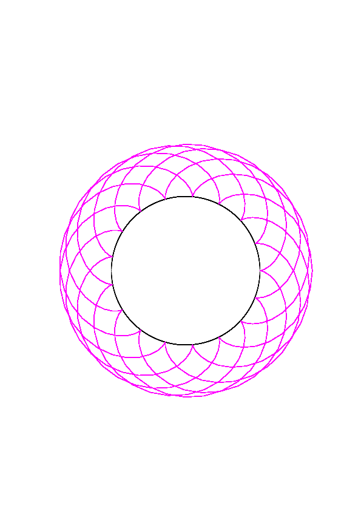

# CS494 - Lab1: Jgraph
## Spirograph Generator: created by Lucas Yarnes

### Overview
This program takes a series of inputs and generates a spirograph, which is a geometric drawing device that produces mathematical roulette curves of the variety known as hypotrochoids and epitrochoids.

### Compiling
In order to compile, simply call `make` and the executable will be created in **bin**

### Parameters
The program **spiro** can be called with either 4 or 7 parameters, which are as follows:
`spiro outer-radius inner-radius distance-to-center print-guide r-color[OPT] g-color[OPT] b-color[OPT]`
which have the following meanings:
- `outer-radius`: the radius of the outer circle in the spirograph
- `inner-radius`: the radius of the inner circle in the spirograph
- `distance-to-center`: a value between [0,`inner-radius`] which describes the position of the pen in reference to the center of the inner circle of the spirograph. 0 means the pen is at the center of the inner circle, and a value `inner-radius` would indicate the pen is at the edge of the inner circle
- `print-guide` : a boolean (can be 0 or 1) that indicates if the outer circle should be printed in addition to the spirograph. It can help visualize how changes in the parameters affect the resulting graph
- `r-color`: an optional parameter ( [0,1] ) to specify the amount of red that should be present in the color of the graph
- `g-color`: an optional parameter ( [0,1] ) to specify the amount of green that should be present in the color of the graph
- `b-color`: an optional parameter ( [0,1] ) to specify the amount of blue that should be present in the color of the graph

### Notes
Some important features of these spirographs to note:
- Typically, the outer radius must be exclusively larger than the inner radius. However, this program is not restricted to that physical limit that physical spirographs must abide by. This produces an interesting result, and is showcased in example 5.
- The closer the trace-point value is the inner radius, the spikier the peaks of the resulting spirograph will be. So too then the closer to 0 the value is, the rounder the resulting spirograph will be.
- I would like to point out that the long run time of programs with more complex graphs is not a result of my program, but a result of jgraph taking forever to interpret the points, since larger graphs include tens of thousands of individual points

### Examples
Below are some example runs of the program with differing values for the radii and trace-point. All of the examples have the print-guide parameter set to true so you have a reference for where the outer circle is.

1. `./bin/spiro 9 5 5 1 1 0 1`

	

2. `./bin/spiro 9 5 2.5 1 1 0 1`

	

3. `./bin/spiro 29 7 6 1 1 0 1`

	

4. `./bin/spiro 29 21 18 1 1 0 1`

	

5. `./bin/spiro 17 23 23 1 1 0 1`

	
